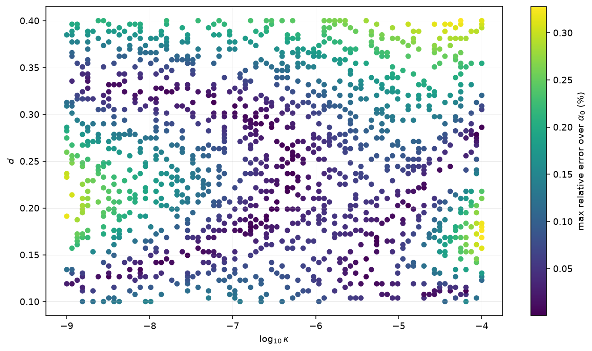
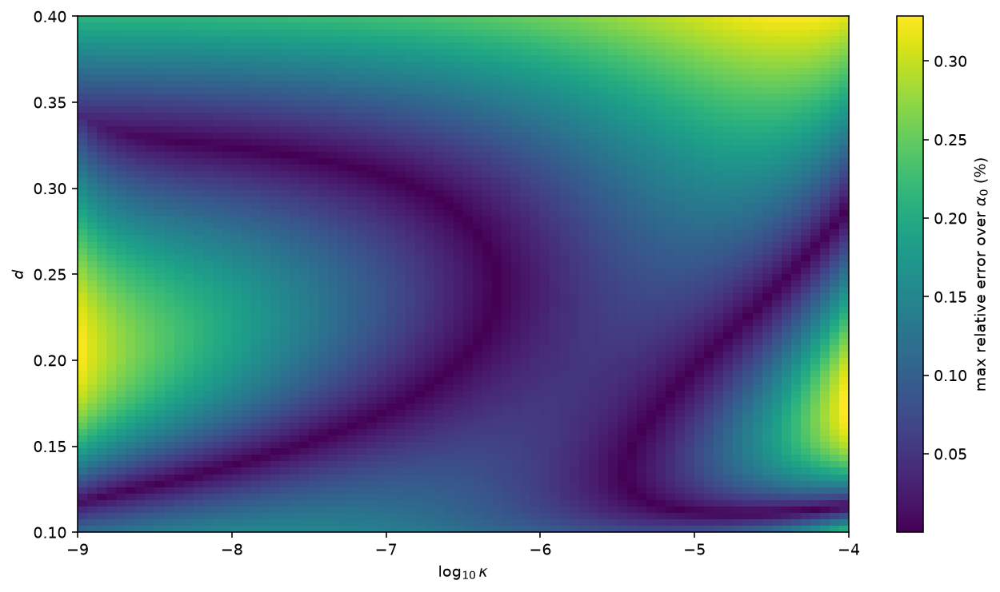

# vcdm-genesis

Numerical scan, analytic fit and figures for the scalar power spectrum of
*Genesis in Minimally Modified Gravity* (Genesis in the VCDM theory).
Version 1.0.0 (2026-09-17).

All results describe the Genesis segment only (`0 < y <= 2(1+d)/d`; spectra
are evaluated at the endpoint `x_f = 1e-7`). Conventions follow the paper:
`b = -tau_B > 0`, `x = tau/tau_B`, `T = 1 + x`, `kappa = -k tau_B`; the
column `alpha` of the data files is `alpha0`.

## Contents

| path | content |
|---|---|
| `genesis_scan_table.csv` | numerical grid, 512,000 rows (`alpha,d,kappa,Ps,ns,alpha_s`) |
| `data/grid_axes.json` | exact parameter axes; `data/genesis_scan_table_provenance.json`: provenance of the table |
| `data/fit_coefficients.json` | the coefficient record of the analytic fit (`c0, c1, q`) with its validation statistics |
| `data/fit_sample_table.csv` | the four sample points of the paper's Table 1 |
| `data/fit_split_manifest.json` | the frozen train/verification split of the fit |
| `vcdm_genesis/` | numerical layer (see `docs/NUMERICAL_METHODS.md`) |
| `tests/` | pytest suite with independent (mpmath) references and regression fixtures |
| `figures/` | `Plot_U.pdf` (Figure 1), `n_s.pdf`, `alpha_s.pdf` (Figure 5), their curve data and manifests |
| `Fitting.ipynb` | fit validation, train/verification split and error heat maps (uses `vcdm_genesis.fit`) |
| `Analytic fit.nb` | Wolfram notebook with the same template and the four sample points |
| `verification_loss.png`, `full_loss.png` | fit error heat maps of the paper's appendix (maximum over `alpha0` per `(d, kappa)` pair, percent) |
| `docs/` | numerical methods and validation record |

## Correspondence with the paper

| paper | repository |
|---|---|
| Figure 1 (`fig:Matter_Potential`), reconstructed matter potential `U(y)` | `figures/Plot_U.pdf`; `python -m vcdm_genesis.figures.plot_u`; `vcdm_genesis/potential.py` |
| Section 3, vacuum initial conditions and endpoint spectra | `vcdm_genesis/modes.py`; `python -m vcdm_genesis.mode_cli` |
| `80^3` scan of the scalar amplitude | `genesis_scan_table.csv`; `python -m vcdm_genesis.table` |
| Figure 5 (`fig:Spectral_Index_and_running`), `n_s` and `alpha_s` | `figures/n_s.pdf`, `figures/alpha_s.pdf`; `python -m vcdm_genesis.figures.spectral_index` |
| Appendix A, phenomenological fit and its coefficients | `vcdm_genesis/fit.py`, `data/fit_coefficients.json`, `Analytic fit.nb` |
| Table 1 (`tab:fit_sample_points`) | `data/fit_sample_table.csv` |
| Appendix figure `fig:fit_validation`, fit accuracy | `full_loss.png`, `verification_loss.png` (`Fitting.ipynb`) |

The other figures of the paper (evolution of `z`, `c_R^2` and `R`, and the
scalar and tensor spectra as functions of `kappa`) are not generated by this
repository.

## Data

The scan uses an `80 x 80 x 80` grid (`data/grid_axes.json`):

| parameter | range | spacing |
|---|---:|---|
| `alpha` (= `alpha0`) | `1e-30` to `1e-21` | log |
| `d` | `0.1` to `0.4` | linear |
| `kappa` (= `-k tau_B`) | `1e-9` to `1e-4` | log |

| column | meaning |
|---|---|
| `alpha`, `d`, `kappa` | input parameters |
| `Ps` | dimensionless scalar power `S_R = tau_B^2 M_Pl^2 P_R = kappa^3/(2 pi^2) |u_hat/z|^2` at `x_f = 1e-7`; the physical amplitude is `Ps/(tau_B^2 M_Pl^2)` |
| `ns` | `1 + d ln Ps / d ln kappa` from centred seven-point finite differences of independently evolved modes (no smoothing) |
| `alpha_s` | `d^2 ln Ps / d ln kappa^2`, same method |

Every `Ps` value is a converged mode evolution with the default solver
settings of `vcdm_genesis.modes` (exact coefficients, retested adiabatic
vacuum selection, DOP853 at `rtol = 1e-10`); see
`data/genesis_scan_table_provenance.json`.

## Analytic fit and validation

Template and coefficients: `data/fit_coefficients.json` (`c0 = 0.0167018906314`,
`c1 = -0.283027102799`, `q = 1.31920847627`), the values quoted in the paper.
The coefficients are fixed. They are not the minimax optimum of the released
training set: the linear programme on the same training groups gives
`c0 = 0.0139557668608`, `c1 = -0.275286738213`, `q = 1.32186006083` with a
maximum error of 0.278 percent (mean 0.114 percent). That alternative is
recorded in the coefficient record for reference and is not used anywhere.

The split holds out complete `(d, kappa)` pairs, keeping all `alpha` values
together (seed 1234, 80 percent training; 409,600 / 102,400 rows;
`data/fit_split_manifest.json`).

| split | mean error | max error |
|---|---:|---:|
| training | 0.1086% | 0.3284% |
| verification | 0.1092% | 0.3276% |
| full grid | 0.1087% | 0.3284% |

These are **errors relative to the numerical table** (fraction convention:
0.3284 percent = 0.003284); they are not integration-error estimates. The
integration accuracy of the underlying histories is characterized separately
in `docs/VALIDATION.md` (relative power changes below `2e-8` under
initial-time doubling, `7e-10` under tolerance tightening, agreement
`2.4e-10` between two formulations on the regression fixture; every returned
start time passes the vacuum checks). The derivative columns are validated at
the regression points to `2e-6` (target) with measured differences below
`1e-7`. Do not extrapolate the fit outside the grid.





## Reproduction

Environment: Python 3.11 or newer with `numpy`, `scipy`, `pandas`,
`matplotlib` (`pip install -r requirements.txt`; tests also need `pytest` and
`mpmath`). The scan table, Figure 5 and the heat maps were produced with
Python 3.14.6, NumPy 2.5.1, SciPy 1.18.0, matplotlib 3.11.0, and Figure 1
with Python 3.12.10, NumPy 2.4.6, SciPy 1.17.1, matplotlib 3.11.0, all on
Windows 11; Linux is untested.

```bash
python -m pytest                                                   # full test suite
python -m vcdm_genesis.figures.plot_u --outdir figures             # Figure 1
python -m vcdm_genesis.figures.spectral_index --outdir figures --processes 8   # Figure 5
python -m vcdm_genesis.mode_cli single --alpha0 1e-23 --d 0.3 --kappa 1e-7 --x-final 0 --outdir out
python -m vcdm_genesis.mode_cli converge --alpha0 1e-30 --d 0.13417721518987344 --kappa 1.2263306841775643e-07 --outdir out
python -m vcdm_genesis.table amplitudes --outdir out/small --alpha0 3e-27 7e-24 --d 0.22 0.33 --kappa-logspace 1e-8 1e-5 9 --processes 4
python -m vcdm_genesis.table assemble --outdir out/small
python -m vcdm_genesis.table derivatives --amplitudes out/small/amplitudes.csv --workdir out/small/deriv --output out/small/table.csv --processes 4
```

The full `80^3` regeneration is an explicit opt-in (about 2.5 h on 18
processes): `python -m vcdm_genesis.table amplitudes --outdir OUT --axes data/grid_axes.json --x-final 1e-7 --processes 18`,
then `assemble` and `derivatives` (about 12 minutes). Post-processing an
existing amplitude table with `derivatives` preserves `Ps` verbatim.

Notebooks: `jupyter nbconvert --to notebook --execute --inplace Fitting.ipynb`
(reads the released table and coefficient record). `Analytic fit.nb` runs in
Mathematica or headlessly with `wolframscript -file scripts/evaluate_analytic_nb.wls`;
it evaluates the template at the four sample points
(`data/fit_sample_table.csv`).

## Limitations

The reconstructed background, quadratic action and endpoint spectra are
Genesis-segment results. A nonlinear cutoff, backreaction, reheating,
matching to a later expansion and observational likelihoods are not
addressed; the Planck bands drawn in Figure 5 are separate marginal
constraints, not a joint constraint at a specified pivot. Neither the fit's
formal infrared limit nor the `alpha0^-1` factorization establishes a global
physical prediction.

## License

Code, data and figures are released under the MIT License (see `LICENSE`).
If you use them, please cite *Genesis in Minimally Modified Gravity*.
